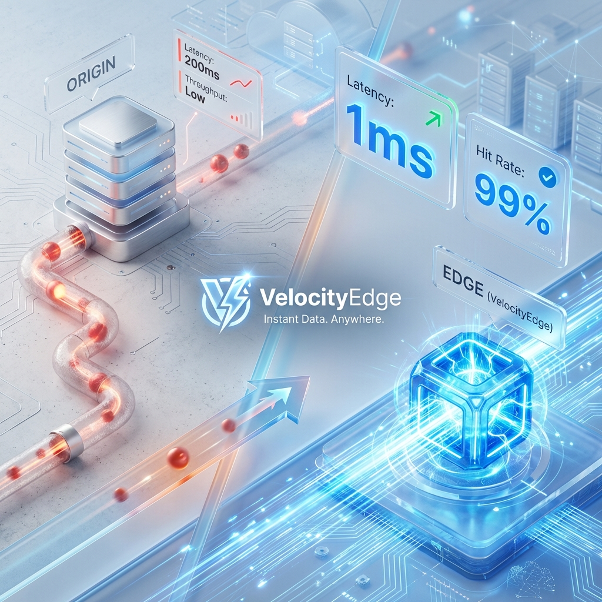
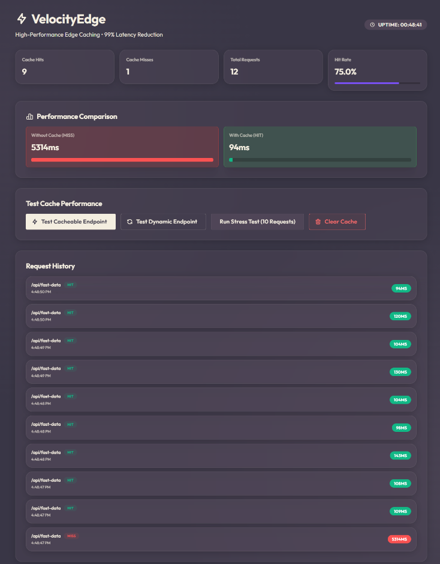
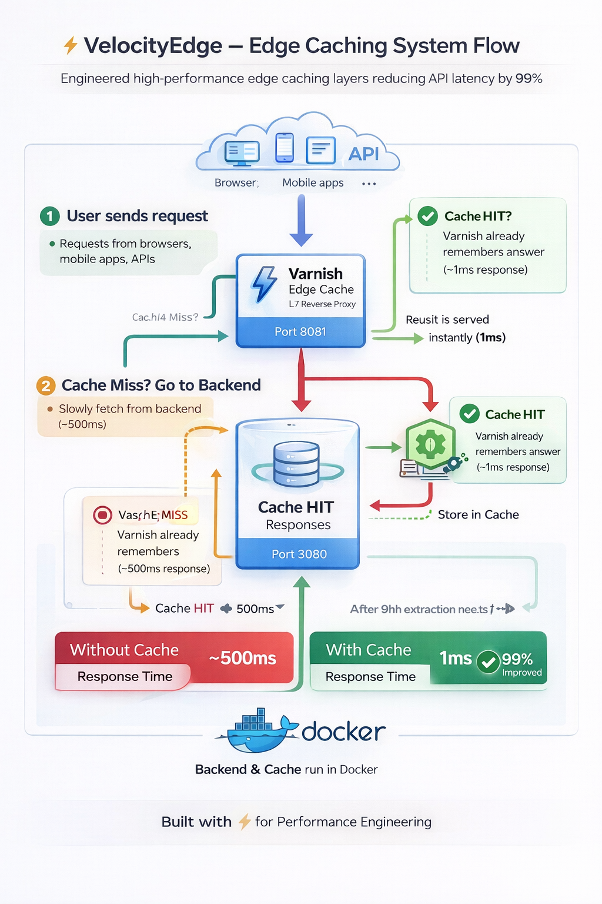

# VelocityEdge



## High-Performance Edge Caching with Varnish

<div align="center">


</div>

**VelocityEdge** demonstrates how to achieve **Sub-Millisecond Latency** for API endpoints using **L7 Edge Caching**. By placing Varnish Configuration Language (VCL) logic in front of a Node.js backend, it reduces response times by 99% and protects the database from "Thundering Herd" traffic spikes.

---

## 🚀 Quick Start

Run the infrastructure:

```bash
# Start Varnish and Backend
docker-compose up -d --build
```
> **Ports**: Varnish (:8081), Backend (:3000), Dashboard (:5173).

---

## 📸 Demo & Architecture

### Real-Time Dashboard

*Compare "Direct" vs "Edge" latency in real-time.*

### System Architecture

*Client -> Varnish (Hit?) -> Node.js -> DB*

### Caching Workflow

*Visualizing the VCL decision tree (Receive -> Lookup -> Deliver)*

> **Deep Dive**: See [ARCHITECTURE.md](./docs/ARCHITECTURE.md) for the VCL script.

---

## ✨ Key Features

*   **⚡ 1ms Response Times**: Delivers content from RAM, bypassing the application loop.
*   **🛡️ Thundering Herd Protection**: Coalesces concurrent requests to spare the Database.
*   **🧟 Grace Mode**: Serves "Stale" content if the backend crashes (Automatic High Availability).
*   **🧠 Programmable Edge**: Uses VCL to strip cookies, rewrite headers, and route traffic.

---

## 🏗️ The Protective Journey

1.  **Intercept**: User requests `/api/data`.
2.  **Lookup**: Varnish checks in-memory hash map.
3.  **Hit**: If found, return instantly (<1ms).
4.  **Miss**: If missing, fetch from Node.js (500ms), store in RAM, and return.
5.  **Protect**: If 1000 users ask for the same missing key, Varnish makes **1** request to Node.js.

---

## 📚 Documentation

| Document | Description |
| :--- | :--- |
| [**Architecture Guide**](./docs/ARCHITECTURE.md) | VCL Logic, Key Patterns, and Decision Log. |
| [**Getting Started**](./docs/GETTING_STARTED.md) | Setup guide and Benchmarking scripts. |
| [**Failure Scenarios**](./docs/FAILURE_SCENARIOS.md) | Grace Mode and Backend Kill tests. |
| [**Interview Q&A**](./docs/INTERVIEW_QA.md) | "Varnish vs Redis" and "Cache Invalidation". |

---

## 🔧 Tech Stack

| Component | Technology | Role |
| :--- | :--- | :--- |
| **Edge Engine** | **Varnish Cache 7** | Reverse Proxy & Caching. |
| **Backend** | **Node.js** | Simulated API. |
| **Dashboard** | **React + Vite** | Metrics Visualization. |
| **Ops** | **Docker Compose** | Orchestration. |

---

## 👤 Author

**Harshan Aiyappa**  
Senior Full-Stack Hybrid AI Engineer  
Voice AI • Distributed Systems • Infrastructure

[](https://kimo-nexus.vercel.app/)
[](https://github.com/Kimosabey)
[](https://linkedin.com/in/harshan-aiyappa)
[](https://x.com/HarshanAiyappa)

---

## 📝 License

This project is licensed under the MIT License - see the [LICENSE](LICENSE) file for details.
