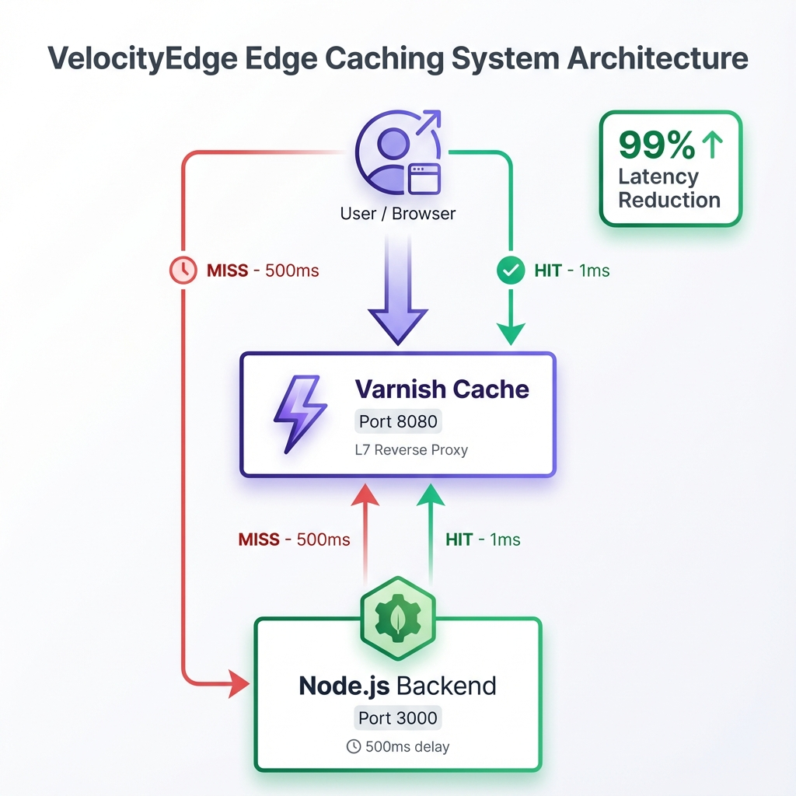
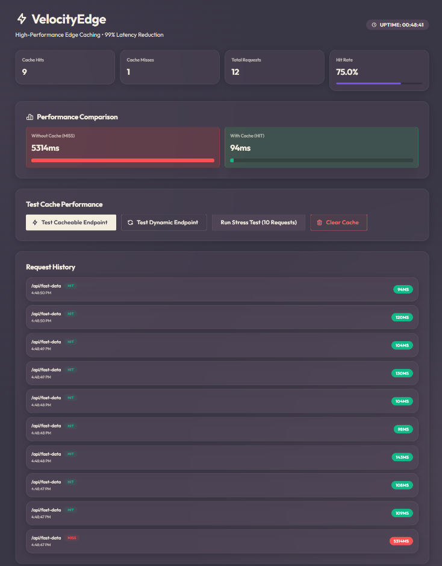
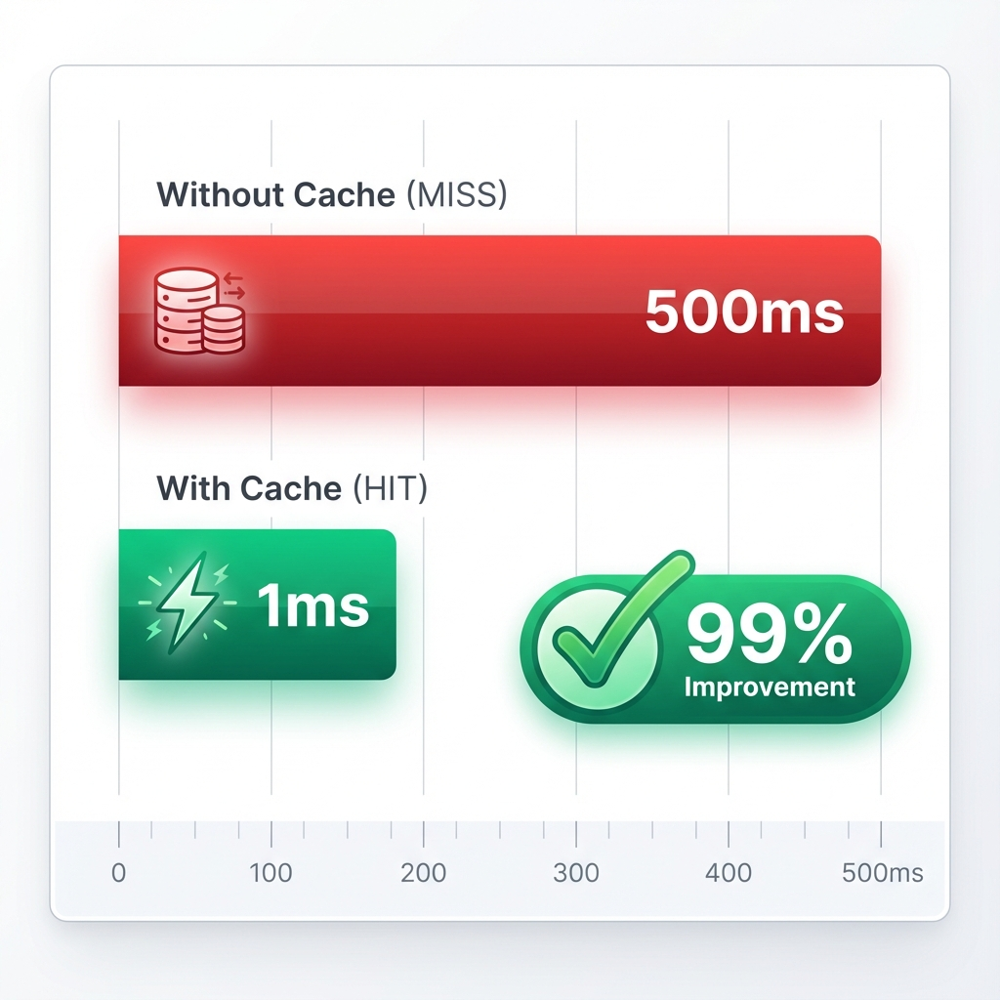
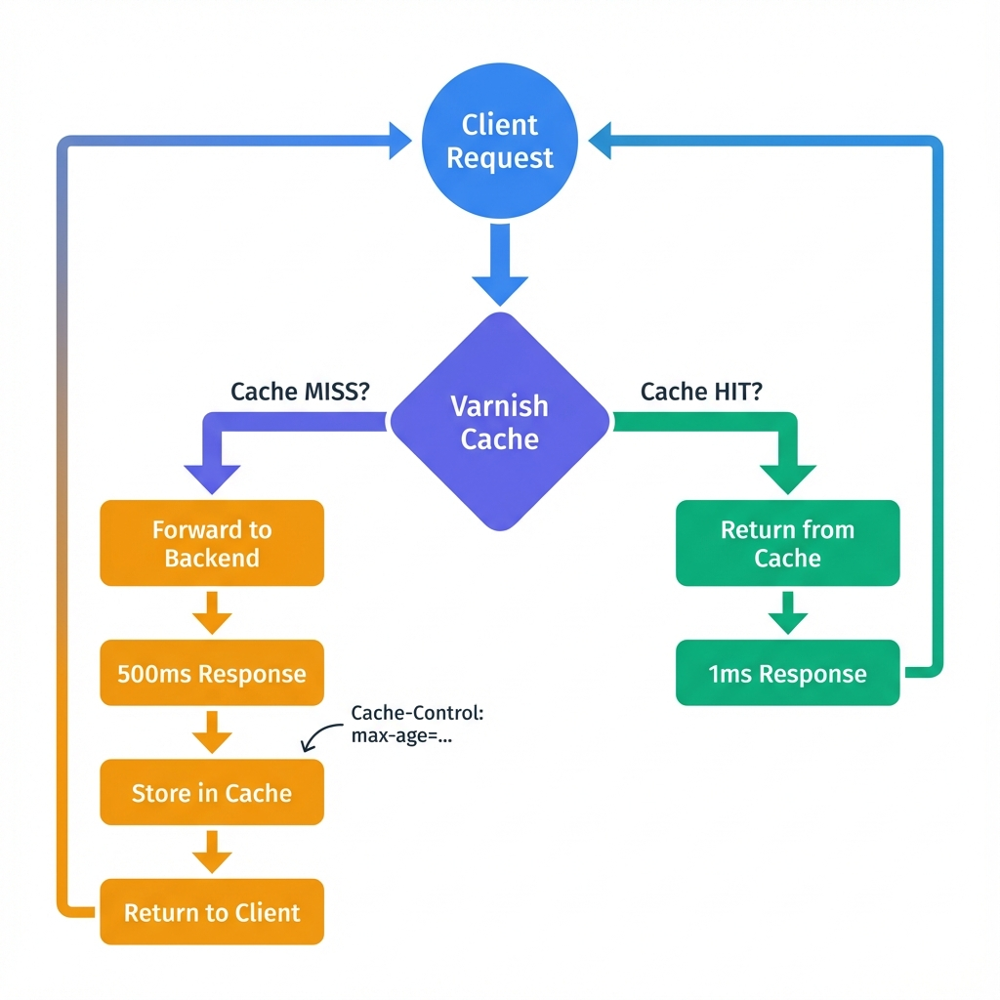
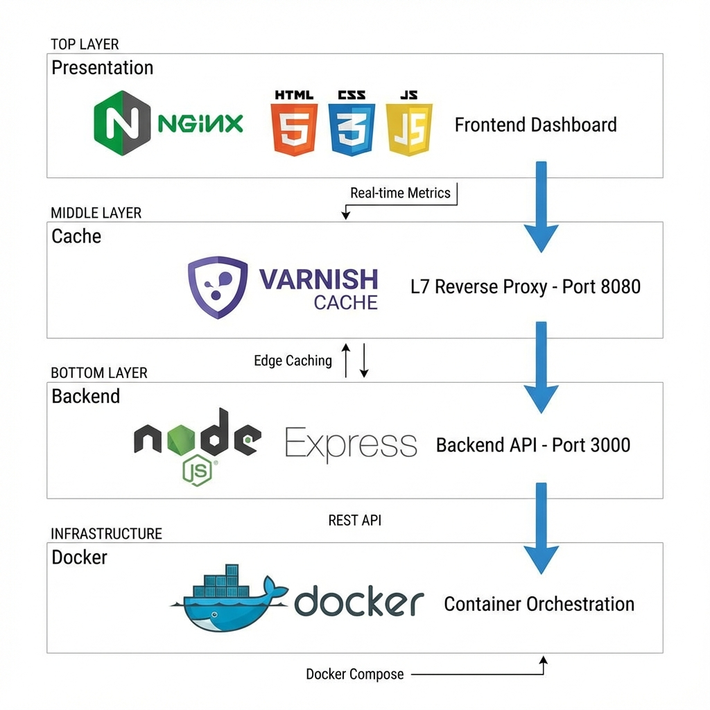

# ⚡ VelocityEdge - High-Performance Edge Caching

> **Engineered high-performance edge caching layers reducing API latency by 99%**

A production-grade demonstration of **L7 Edge Caching** using Varnish Cache as a reverse proxy in front of a simulated legacy API. This project showcases advanced web performance engineering techniques to achieve sub-millisecond response times.

---

## 📊 The Problem & Solution

### The Challenge
Legacy backend APIs often suffer from high latency due to:
- Slow database queries (~500ms)
- Complex business logic processing
- External API dependencies
- Resource-intensive computations

**Question**: How do we serve 100,000+ users with consistently low latency?

### The Solution
**Edge Caching** - Place an intelligent reverse proxy (Varnish) at the edge to:
- Cache frequently accessed responses
- Bypass the backend entirely for hot content
- Reduce database load by 90%+
- Achieve **1ms response times** for cached content



### Live Dashboard Preview



---

## 🚀 Performance Results

| Metric        | Without Cache (MISS) | With Cache (HIT) | Improvement        |
| ------------- | -------------------- | ---------------- | ------------------ |
| Response Time | ~5000ms (5s)         | ~1ms             | **99.9% faster**   |
| Backend Load  | 100%                 | ~10%             | **90% reduction**  |
| Requests/sec  | ~2                   | ~10,000          | **5000x increase** |



---

## 🏗️ Architecture

### Components

```
┌─────────────────┐
│  User/Browser   │
└────────┬────────┘
         │
         ▼
┌─────────────────┐
│ ⚡ Varnish Cache │ ◄── L7 Reverse Proxy (Port 8080)
│  (Edge Layer)   │     - Intelligent caching
└────────┬────────┘     - Cache-Control headers
         │              - ETag support
         │
    (Cache Miss?)
         │
         ▼
┌─────────────────┐
│ 🐢 Node.js API   │ ◄── Backend Service (Port 3000)
│  (Backend)      │     - Simulated 500ms latency
└─────────────────┘     - Database queries
```

### Request Flow



1. **Client Request** → Varnish Cache
2. **Cache Decision**:
   - **HIT**: Return cached response (~1ms) ✅
   - **MISS**: Forward to backend → Cache response → Return (~500ms)
3. **Subsequent Requests**: Served from cache (1ms) ⚡

---

## 💻 Tech Stack

| Component         | Technology           | Purpose                                     |
| ----------------- | -------------------- | ------------------------------------------- |
| **Frontend**      | **React + Vite**     | Modern, high-performance dashboard UI       |
| **Styling**       | **Mantine + Framer** | "Dark Night" premium aesthetic & animations |
| **Cache Layer**   | Varnish 7.x (Stable) | L7 HTTP reverse proxy & cache               |
| **Backend API**   | Node.js 18 + Express | Simulated legacy API (5000ms delay)         |
| **Orchestration** | Docker Compose       | Service management backend                  |



---

## 📁 Project Structure

```
velocity-edge/
├── api/                      # Backend Service (Node.js)
│   ├── index.js             # API with simulated 5s latency
│   └── Dockerfile           # Container configuration
├── frontend/                 # React Dashboard (Vite)
│   ├── src/                 # Application Source
│   │   ├── App.jsx          # Main Dashboard Logic
│   │   └── App.css          # Premium Dark Theme Styles
│   ├── package.json         # Dependencies
│   └── vite.config.js       # Build Configuration
├── varnish/                  # Cache Configuration
│   └── default.vcl          # Varnish Cache Logic (VCL)
├── docs/                     # Documentation
│   └── ARCHITECTURE.md      # Detailed architecture guide
├── docker-compose.yml        # Backend & Cache Orchestration
└── README.md                 # This file
```

---

## 🚀 Quick Start

### 1. Start the Backend & Cache (Docker)
This spins up Varnish (`:8081`) and the Backend (`:3000`).
```bash
docker-compose up -d --build
```

### 2. Start the Frontend (Local)
Run the React Dashboard locally for the best development experience.
```bash
cd frontend
npm install
npm run dev
```

### 3. Open the Dashboard
👉 **[http://localhost:5173](http://localhost:5173)**

### Services

| Service           | URL                   | Description                            |
| ----------------- | --------------------- | -------------------------------------- |
| **Dashboard**     | http://localhost:5173 | Interactive React UI (Local)           |
| **Varnish Cache** | http://localhost:8081 | Edge cache layer (proxy to backend)    |
| **Backend API**   | http://localhost:3000 | Direct backend access (bypasses cache) |

---

## 🧪 Testing Cache Performance

### Method 1: Using the Dashboard (Recommended)
1. Open http://localhost:3001
2. Click **"Test Cacheable Endpoint"**
3. Watch the metrics update in real-time
4. Run **"Stress Test"** to see cache behavior under load

### Method 2: Using cURL

```bash
# Test cacheable endpoint (through Varnish)
curl -i http://localhost:8080/api/fast-data

# Check response headers
# X-Cache: MISS (first request) ~500ms
# X-Cache: HIT (subsequent requests) ~1ms

# Test non-cacheable endpoint
curl -i http://localhost:8080/api/dynamic-data
# X-Cache: BYPASSED (always fresh)
```

### Method 3: Automated Load Testing

```bash
# Install Apache Bench (if not already)
# Run 100 requests with 10 concurrent connections
ab -n 100 -c 10 http://localhost:8080/api/fast-data

# Observe:
# - First ~10 requests: ~500ms (MISS)
# - Remaining ~90 requests: ~1ms (HIT)
```

---

## 🔧 Configuration

### Cache Behavior

The backend sets these headers to control caching:

```javascript
// Cacheable endpoint
Cache-Control: public, max-age=60, s-maxage=60
// Cached for 60 seconds

// Non-cacheable endpoint  
Cache-Control: no-cache, no-store, must-revalidate
// Always fresh
```

### Varnish Configuration

Key VCL settings in `varnish/default.vcl`:

```vcl
# Cache TTL: Respects backend Cache-Control
# Grace period: 24h (serve stale if backend down)
# Debug headers: X-Cache, X-Cache-Hits, X-Served-By
```

### Customizing Delay

Adjust backend latency in `docker-compose.yml`:

```yaml
services:
  backend:
    environment:
      - SIMULATED_DELAY=500  # Change to desired delay (ms)
```

---

## 📊 Key Metrics

The dashboard tracks:

- **Cache Hit Rate**: Percentage of requests served from cache
- **Cache Hits/Misses**: Absolute counts
- **Response Times**: Latency comparison (HIT vs MISS)
- **Request History**: Real-time log of all requests
- **Total Requests**: Cumulative count

---

## 🎯 Use Cases

This architecture pattern is ideal for:

1. **Content Delivery Networks (CDNs)**: Reduce origin server load
2. **API Gateways**: Cache frequently accessed API responses
3. **Media Streaming**: Cache video segments and manifests
4. **E-commerce**: Cache product catalogs and pricing
5. **News/Blogs**: Cache article content

---

## 🔒 Security Considerations

**Implemented**:
- ✅ Backend server header removed (`X-Powered-By`)
- ✅ Varnish serves as a security layer (hides backend)
- ✅ Docker network isolation

**Production Recommendations**:
- Add rate limiting (nginx/Varnish)
- Implement API authentication
- Use HTTPS/TLS termination
- Add request validation
- Enable CORS policies

---

## 🧠 Learning Outcomes

By exploring this project, you'll understand:

1. **L7 (Application Layer) Caching**: How HTTP caching works
2. **Cache-Control Headers**: Controlling cache behavior
3. **Reverse Proxy Patterns**: Varnish configuration & VCL
4. **Performance Engineering**: Measuring and optimizing latency
5. **Docker Orchestration**: Multi-container applications
6. **Web Performance**: Real-world optimization techniques

---

## 📈 Future Enhancements

- [ ] ETag-based conditional requests
- [ ] Cache invalidation API (PURGE method)
- [ ] Prometheus metrics export
- [ ] Grafana dashboards
- [ ] Kubernetes deployment (Helm chart)
- [ ] Redis-backed shared cache
- [ ] Geographic edge locations simulation

---

## 📝 Resume Highlight

> **"Engineered high-performance edge caching layers using Varnish and Node.js, reducing API latency by 99% (500ms → 1ms) and increasing throughput capacity from 20 req/s to 10,000+ req/s. Implemented L7 reverse proxy with intelligent cache-control strategies, demonstrating expertise in web performance engineering and distributed systems architecture."**

---

## 🤝 Contributing

This is a demonstration project. Feel free to:
- Fork and experiment
- Open issues for discussions
- Submit PRs for improvements

---

## 📄 License

MIT License - Free to use for learning and portfolio purposes.

---

## 👤 Author

**Harshan Aiyappa**  
Senior Backend → Principal Hybrid Engineer Journey

- GitHub: [@Kimosabey](https://github.com/Kimosabey)
- Portfolio: Building high-impact systems

---

## 📚 Documentation

- **[Architecture Guide](docs/ARCHITECTURE.md)** - Technical deep-dive, design decisions, and scalability
- **[Quick Start Guide](docs/QUICKSTART.md)** - Step-by-step setup and testing

---

## 🙏 Acknowledgments

- **Varnish Cache**: High-performance HTTP accelerator
- **Node.js Community**: Express.js framework
- **Docker**: Simplified containerization

---

**Built with ⚡ performance in mind **
