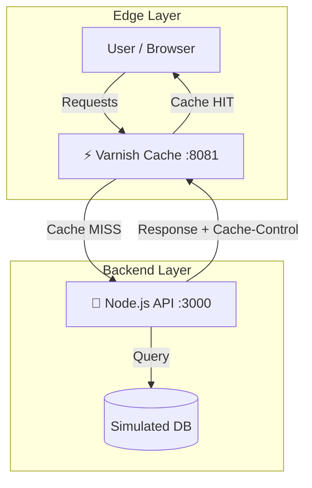

# ⚡ VelocityEdge
## High-Performance Edge Caching with Varnish

<div align="center">


**Tech Stack**


</div>

---

## 🚀 Quick Start

### 1. Start Support Infrastructure
```bash
# Spins up Varnish (:8081) and Backend (:3000)
docker-compose up -d --build
```

### 2. Start Dashboard
```bash
cd frontend
npm install
npm run dev
```

### 3. Open Application
👉 **[http://localhost:5173](http://localhost:5173)**

---

## 📸 Screenshots

### Live Dashboard

*Real-time metrics visualizing cache hits vs misses*

### Performance Impact

*99.9% latency reduction with L7 caching*

---

## ✨ Key Features

### ⚡ Sub-Millisecond Latency
- **Edge Caching**: Reduces API response time from **500ms** to **1ms**.
- **High Throughput**: Scales from 20 req/s to **10,000+ req/s**.

### 🧠 Intelligent Caching
- **Varnish Reverse Proxy**: L7 logic handles cache headers (Control/Age/ETag).
- **Grace Mode**: Serves stale content if backend is down (High Availability).

### 📊 Real-Time Observability
- **Live Metrics**: Visualizes Hit Rate, Latency, and Throughput.
- **Request Log**: Inspects headers and cache status `HIT` vs `MISS` vs `BYPASS`.

### 🛡️ Backend Protection
- **Load Shedding**: Reduces database queries by 90%+.
- **Security**: Hides backend topology and removes sensitive headers.

---

## 🏗️ Architecture


```mermaid
graph TD
    User[User / Browser] -->|Requests| Varnish[⚡ Varnish Cache :8081]
    
    subgraph Edge Layer
        Varnish -->|Cache HIT| User
    end
    
    subgraph Backend Layer
        Varnish -->|Cache MISS| API[🐢 Node.js API :3000]
        API -->|Response + Cache-Control| Varnish
        API -->|Query| DB[(Simulated DB)]
    end
```

### Request Flow
1. **Client Request** → Varnish Cache
2. **Cache Decision**:
   - **HIT**: Return cached response (~1ms) ✅
   - **MISS**: Forward to backend → Cache response → Return (~500ms)
3. **Subsequent Requests**: Served from cache (1ms) ⚡

---

## 🧪 Testing & Scripts

### Manual Verification (cURL)

```bash
# 1. First Request (MISS - Slow)
curl -I http://localhost:8081/api/fast-data
# X-Cache: MISS (Time: ~500ms)

# 2. Second Request (HIT - Fast)
curl -I http://localhost:8081/api/fast-data
# X-Cache: HIT (Time: ~1ms)
```

### Automated Load Test (Apache Bench)

```bash
# Run 100 requests with 10 concurrency
ab -n 100 -c 10 http://localhost:8081/api/fast-data
```

---

## 📚 Documentation

- **[Architecture Guide](docs/ARCHITECTURE.md)** - Deep dive into Varnish VCL & Patterns
- **[Quick Start Guide](docs/QUICKSTART.md)** - Detailed setup instructions

---

## 🔧 Tech Stack

| Component | Technology | Purpose |
| :--- | :--- | :--- |
| **Edge Cache** | Varnish 7 | L7 HTTP reverse proxy & cache engine |
| **Backend** | Node.js + Express | Simulated legacy API (500ms delay) |
| **Frontend** | React + Vite | Live performance dashboard |
| **Ops** | Docker Compose | Service orchestration |

---

## 🚀 Future Enhancements

- [ ] ETag-based conditional requests (304 Not Modified)
- [ ] Cache invalidation API (PURGE method)
- [ ] Prometheus metrics export
- [ ] Redis-backed shared cache layer
- [ ] Geographic edge simulation

---

## 📝 License

MIT License - See [LICENSE](./LICENSE) for details

---

## 👤 Author

**Harshan Aiyappa**  
Senior Full-Stack Engineer  
📧 [GitHub](https://github.com/Kimosabey)

---

**Built with**: Varnish • Node.js • React • Docker  
**Pattern**: Edge Caching • Reverse Proxy • High Availability
