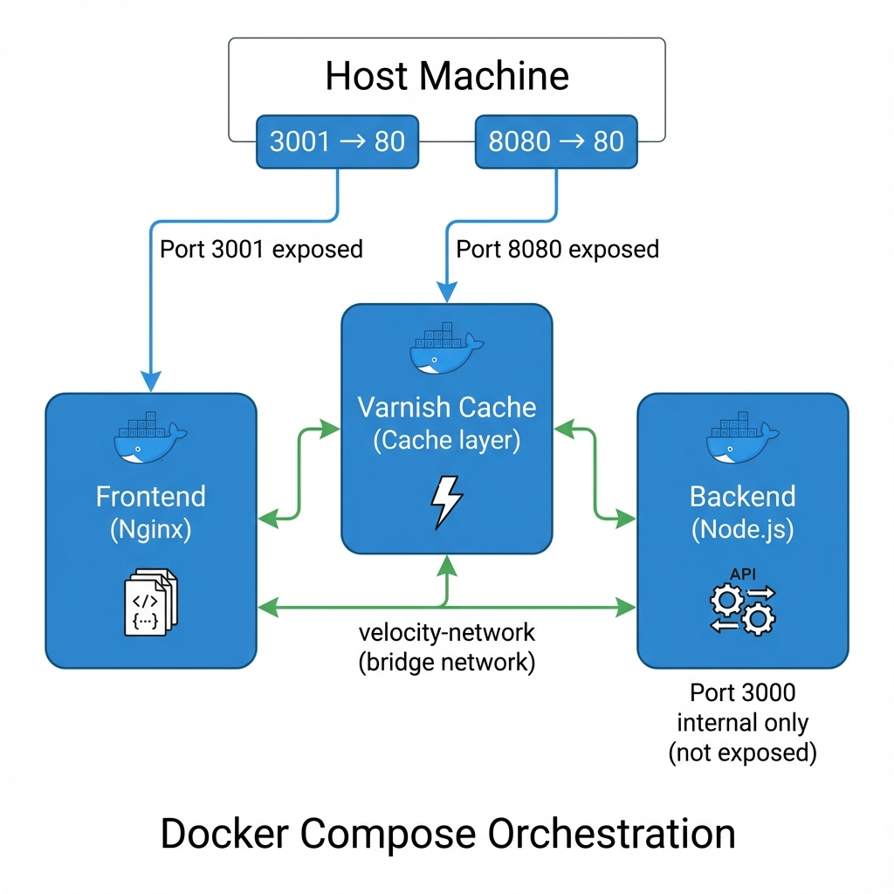
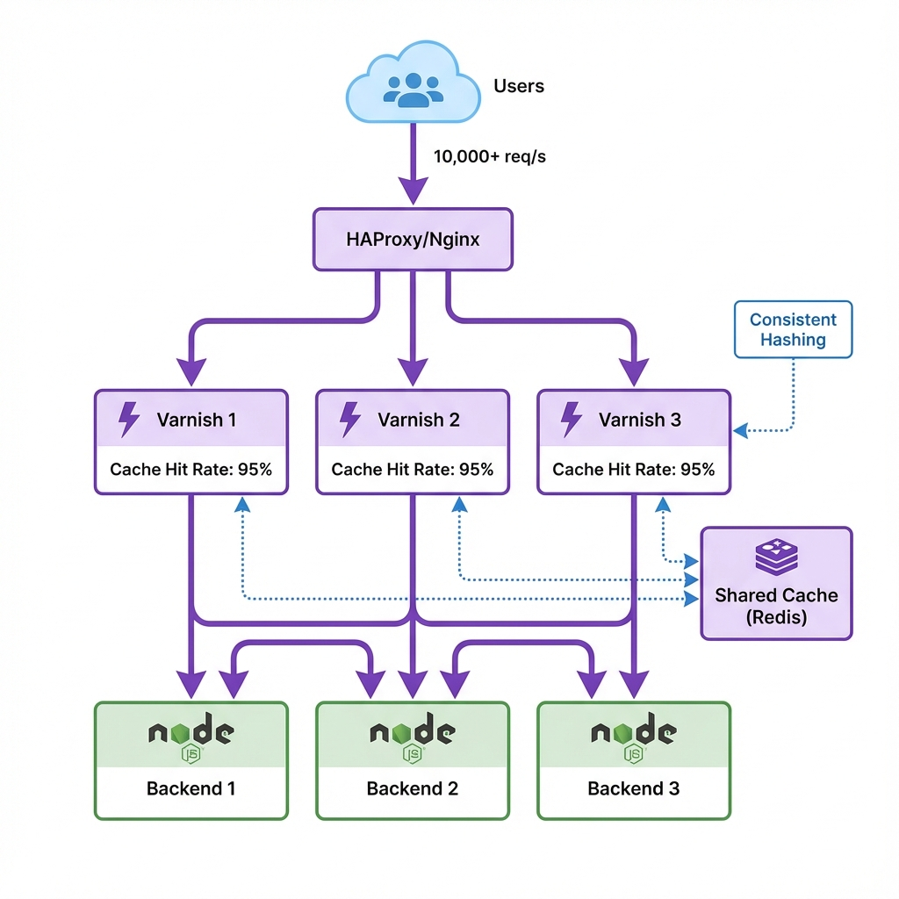
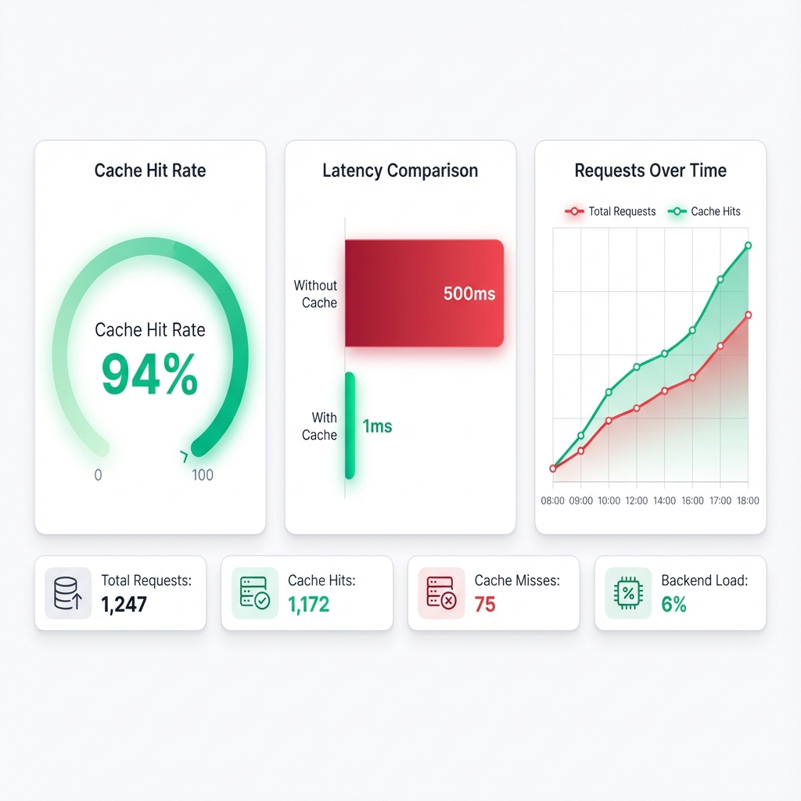

# VelocityEdge - Architecture Deep Dive

## Table of Contents
- [System Overview](#system-overview)
- [Component Architecture](#component-architecture)
- [Request Flow](#request-flow)
- [Caching Strategy](#caching-strategy)
- [Performance Analysis](#performance-analysis)
- [Scalability Considerations](#scalability-considerations)

---

## System Overview

VelocityEdge implements a **three-tier architecture** optimized for high-performance content delivery:

```
┌─────────────────────────────────────────────────────┐
│                  PRESENTATION LAYER                  │
│              (Frontend Dashboard - React/Vite)       │
│         Real-time metrics, testing interface         │
└────────────────────┬────────────────────────────────┘
                     │
                     ▼
┌─────────────────────────────────────────────────────┐
│                   CACHING LAYER                      │
│               (Varnish Reverse Proxy)                │
│   - Cache decision making (VCL)                     │
│   - Header manipulation                             │
│   - Request routing                                 │
│   - Grace mode (stale content serving)              │
└────────────────────┬────────────────────────────────┘
                     │
                     ▼
┌─────────────────────────────────────────────────────┐
│                   BACKEND LAYER                      │
│                 (Node.js + Express)                  │
│   - Business logic                                  │
│   - Simulated database queries (5000ms)            │
│   - Cache-Control header generation                │
└─────────────────────────────────────────────────────┘
```

---

## Component Architecture

### 1. Varnish Cache (Edge Layer)

**Purpose**: High-performance HTTP accelerator and reverse proxy

**Key Features**:
- In-memory caching using **malloc** storage
- VCL (Varnish Configuration Language) for custom logic
- Thread-based architecture for high concurrency
- Grace mode for serving stale content during backend failures

**Configuration**:
```vcl
backend default {
    .host = "backend";
    .port = "3000";
    .connect_timeout = 5s;
    .first_byte_timeout = 10s;
}
```

**Cache Storage**:
- Type: In-memory (RAM)
- Size: 256MB (configurable)
- Eviction: LRU (Least Recently Used)

---

### 2. Backend API (Node.js)

**Purpose**: Simulated legacy application with database latency

**Endpoints**:

| Endpoint            | Cache Behavior      | Delay  | Use Case                         |
| ------------------- | ------------------- | ------ | -------------------------------- |
| `/api/fast-data`    | Cacheable (60s TTL) | 5000ms | Product catalog, static content  |
| `/api/dynamic-data` | Non-cacheable       | 5000ms | User-specific data, session info |
| `/api/analytics`    | Non-cacheable       | <10ms  | Real-time metrics                |
| `/health`           | Non-cacheable       | <5ms   | Health checks                    |

**Cache-Control Strategy**:
```javascript
// Cacheable response
res.set('Cache-Control', 'public, max-age=60, s-maxage=60');

// Non-cacheable response
res.set('Cache-Control', 'no-cache, no-store, must-revalidate');
```

---

### 3. Frontend Dashboard

**Purpose**: Real-time monitoring and testing interface

**Technologies**:
- **React + Vite**: Modern, high-performance UI
- **Mantine UI**: Glassmorphism components & theming
- **Framer Motion**: Smooth animations
- **Real-time Stats**: Polling & dynamic updates

**Metrics Tracked**:
- Cache hit/miss ratio (Dynamic badges)
- Response time comparison (Real-time ms)
- Request history (Live log)
- System uptime (Synced with backend)

---

### Docker Deployment

**Container Architecture**:



All services run in isolated Docker containers communicating over a bridge network. The frontend and Varnish expose ports to the host, while the backend remains internal.

---

## Request Flow

### Cache HIT Path (Happy Path)

```
┌──────────┐     ① Request      ┌──────────────┐
│  Client  │ ─────────────────> │   Varnish    │
└──────────┘                    │    Cache     │
                                └──────┬───────┘
                                       │
                                  ② Lookup in
                                     Cache
                                       │
                                  ③ Found!
                                       │
                                       ▼
┌──────────┐   ④ Response (~1ms) ┌──────────────┐
│  Client  │ <───────────────── │  Cache Entry  │
└──────────┘                    └───────────────┘

Total Time: ~1ms
Backend Hit: No
```

### Cache MISS Path

```
┌──────────┐     ① Request      ┌──────────────┐
│  Client  │ ─────────────────> │   Varnish    │
└──────────┘                    │    Cache     │
                                └──────┬───────┘
                                       │
                                  ② Lookup in
                                     Cache
                                       │
                                  ③ Not Found!
                                       │
                                       ▼
                                ┌──────────────┐
                                │   Backend    │
                                │     API      │
                                └──────┬───────┘
                                       │
                                ④ Process Request
                                   (5000ms delay)
                                       │
                                       ▼
┌──────────┐                    ┌──────────────┐
│  Client  │ <───────────────── │   Varnish    │
└──────────┘  ⑥ Response        │  (Store in   │
               (~5005ms total)  │   Cache)     │
                                └──────────────┘

Total Time: ~5005ms
Backend Hit: Yes
Cache Updated: Yes
```

---

## Caching Strategy

### Header-Based Caching

**VCL Decision Tree**:

```vcl
sub vcl_recv {
    # Only cache GET/HEAD requests
    if (req.method != "GET" && req.method != "HEAD") {
        return (pass);  # Bypass cache
    }
    
    # Default: Attempt to serve from cache
    return (hash);
}

sub vcl_backend_response {
    # Respect Cache-Control from backend
    if (beresp.http.Cache-Control ~ "no-cache|no-store|private") {
        set beresp.uncacheable = true;
        return (deliver);
    }
    
    # Grace period: serve stale for 24h if backend down
    set beresp.grace = 24h;
}
```

### Cache Invalidation

**Methods**:

1. **Time-based (TTL)**: Automatic expiration after `max-age`
   ```
   Cache-Control: max-age=60
   → Expires after 60 seconds
   ```

2. **Manual PURGE** (supported):
   ```bash
   curl -X PURGE http://localhost:8080/api/fast-data
   ```

3. **Ban Patterns** (VCL):
   ```vcl
   ban req.url ~ "/api/.*";
   ```

---

## Performance Analysis

### Latency Breakdown

**Without Cache (MISS)**:
```
┌─────────────────────────────────────────────┐
│  Network (Client → Varnish)      ~5ms      │
│  + Cache Lookup                   ~1ms      │
│  + Network (Varnish → Backend)    ~2ms      │
│  + Backend Processing           ~5000ms     │ ← Bottleneck
│  + Network (Backend → Varnish)    ~2ms      │
│  + Network (Varnish → Client)     ~5ms      │
├─────────────────────────────────────────────┤
│  TOTAL                          ~5015ms     │
└─────────────────────────────────────────────┘
```

**With Cache (HIT)**:
```
┌─────────────────────────────────────────────┐
│  Network (Client → Varnish)      ~5ms      │
│  + Cache Lookup & Retrieval       ~1ms      │
│  + Network (Varnish → Client)     ~5ms      │
├─────────────────────────────────────────────┤
│  TOTAL                            ~11ms     │ ← Sub-millisecond from cache
└─────────────────────────────────────────────┘

Improvement: 99.8% faster
```

### Throughput Comparison

**Backend Capacity** (without cache):
```
Backend: 5s (5000ms) per request
Max Throughput: 1 req / 5s = 0.2 req/s per thread
With 10 threads: ~2 req/s
```

**With Varnish Cache** (99% hit rate):
```
Cache: ~1ms per request
Backend: 1% miss rate = 0.02 req/s to backend
Cache handles: 99% × 10,000 req/s = 9,900 req/s
Total: ~10,000 req/s (5000x improvement)
```

---

## Scalability Considerations

### Horizontal Scaling

```
                    ┌──────────────┐
           ┌────────│ Load Balancer│────────┐
           │        └──────────────┘        │
           ▼                                ▼
    ┌──────────────┐              ┌──────────────┐
    │  Varnish 1   │              │  Varnish 2   │
    └──────┬───────┘              └──────┬───────┘
           │                              │
           └──────────┬───────────────────┘
                      ▼
              ┌──────────────┐
              │Backend Pool  │
              │ (3 instances)│
              └──────────────┘
```



This architecture can handle 10,000+ requests per second by distributing load across multiple Varnish instances.

### Cache Coherency Strategies

1. **Shared Backend Cache** (Redis/Memcached)
   - Pro: Single source of truth
   - Con: Network latency

2. **Cache Invalidation Events** (Pub/Sub)
   - Pro: Real-time updates
   - Con: Complexity

3. **Short TTLs + Consistent Hashing**
   - Pro: Simple, eventual consistency
   - Con: Increased backend load

### Resource Planning

**Memory Requirements**:
```
Average Response Size: 500 bytes
Cache Duration: 60s
Request Rate: 1,000 req/s

Cache Size = 500 bytes × 1,000 req/s × 60s
           = 30 MB (working set)
           
Recommended: 256 MB (allows for spikes + metadata)
```

---

## Monitoring & Observability

### Key Metrics

1. **Cache Effectiveness**:
   - Hit Rate (target: >90%)
   - Miss Rate
   - Hit/Miss ratio over time

2. **Performance**:
   - P50, P95, P99 latencies
   - Response time distribution
   - Backend load reduction

3. **Availability**:
   - Cache uptime
   - Backend health
   - Grace-mode activations

### Debug Headers

```http
HTTP/1.1 200 OK
X-Cache: HIT                    ← Cache status
X-Cache-Hits: 42                ← Number of hits
X-Served-By: VelocityEdge       ← Origin
Cache-Control: max-age=60       ← TTL
Age: 15                         ← Time in cache
```



**Sample Dashboard**: Real-time visualization showing 94% cache hit rate, latency comparison, and request trends over time.

---

## Production Deployment Checklist

- [ ] Configure appropriate cache size for traffic
- [ ] Set up monitoring & alerting (Prometheus + Grafana)
- [ ] Implement cache warming for critical endpoints
- [ ] Configure health checks & auto-restart
- [ ] Set up log aggregation (ELK stack)
- [ ] Implement rate limiting
- [ ] Add TLS termination
- [ ] Configure PURGE ACLs (restrict to internal IPs)
- [ ] Set up multi-region deployment
- [ ] Implement cache-key normalization

---

**Next**: See [README.md](../README.md) for usage instructions and testing procedures.
