# 🏗️ System Architecture: VelocityEdge

## 1. High-Level Design (HLD)

VelocityEdge implements the **L7 Edge Caching Pattern** using **Varnish**. It sits in front of standard APIs to intercept traffic, offloading 99% of read requests from the backend database.

```mermaid
graph TD
    User-->|HTTP Request| Varnish[🛡️ Varnish Edge Cache]
    
    subgraph "DMZ (Protected)"
        Varnish -->|Cache Miss| API[🐢 Node.js API]
        API -->|SQL Query| DB[(PostgreSQL)]
    end
    
    Varnish -->|Cache Hit| User
```




### Core Components
1.  **Varnish Cache (Reverse Proxy)**: The entry point. Handles thousands of concurrent connections. Configured via **VCL** (Varnish Configuration Language).
2.  **Node.js Backend**: Represents a typical "slow" service (simulated 500ms latency).
3.  **React Dashboard**: A control plane that bypasses the cache to fetch real-time operational metrics.

---

## 2. Low-Level Design (LLD)

### Caching Logic (VCL)
The intelligence lies in `default.vcl`. Note that we strip cookies to ensure high cache-hit rates for public data.

```vcl
sub vcl_recv {
    # 1. Bypass Cache for non-GET requests
    if (req.method != "GET" && req.method != "HEAD") {
        return (pass);
    }
    
    # 2. Aggressive Caching: Strip Cookies for static API endpoints
    if (req.url ~ "^/api/public") {
        unset req.http.Cookie;
    }
}

sub vcl_backend_response {
    # 3. Time-To-Live: Force 1 minute cache
    if (bereq.url ~ "^/api/fast-data") {
        set beresp.ttl = 60s;
        set beresp.grace = 1h; # Serve stale if backend dies
    }
}
```

### Metrics Collection
The Dashboard doesn't just guess; it measures.
*   **Latency**: Calculated as `ResponseTime - RequestTime`.
*   **Hit/Miss**: Detected via the `X-Cache` header injected by Varnish.

---

## 3. Decision Log

| Decision | Alternative | Reason for Choice |
| :--- | :--- | :--- |
| **Varnish** | Nginx | **Granularity**. Varnish's VCL allows programmable logic (e.g., "Cache only if header X exists"). Nginx is primarily a web server; Varnish is a dedicated caching engine. |
| **Docker Compose** | AWS CloudFront | **Portability**. CloudFront implies AWS lock-in. Varnish runs anywhere (On-Prem, Kubernetes, Laptop), proving the architectural pattern without vendor dependency. |
| **Pull-Based Metrics** | Push-Gateway | **Simplicity**. The frontend polls the backend status endpoints. For a demo, this avoids setting up Prometheus + Grafana complexity. |

---

## 4. Key Patterns

### The "Thundering Herd" Protection
When a cache item expires, thousands of users might requesting it simultaneously. Varnish implements **Request Coalescing**: it sends *one* request to the backend, puts the other 999 users on hold, updates the cache, and then serves everyone. This prevents DB spikes.

### Grace Mode (High Availability)
If the Node.js backend crashes, Varnish is configured (`beresp.grace`) to continue serving the "stale" content for up to 1 hour. This turns a **L0 Outage** into a minor "Data Staleness" incident.
